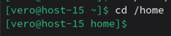
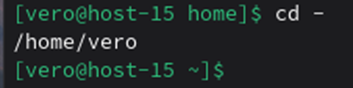
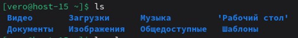
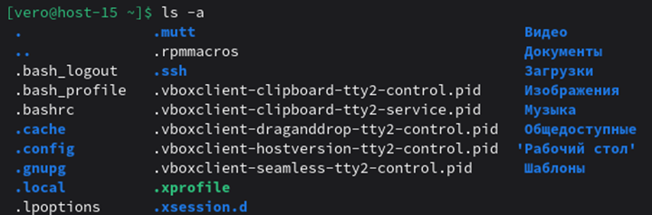
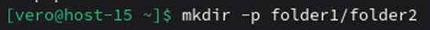
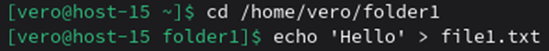
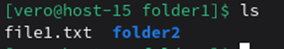
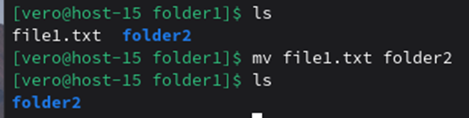
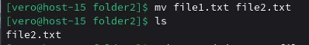
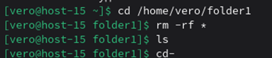

# Работа в консольке
Work whith files
1) Переместиться между директориями\n\
команда cd

cd – (Перейти в предыдущую директорию)

2) Вывести список файлов в директории\n\
ls

3) Вывести список Всех файлов в директории\n\
ls -l #Детальная информация

ls -a  #Показ скрытых файлов

4) Создать папку с подпапками\n\
mkdir -p parent/child

5) Внутри папки создать файлик и записать в него что-нибудь\n\
#перейти в папку\n\
echo "Привет, мир!" > hello.txt # создать файл и записать в него текст

6) Переместить файл из одно директории в другую\n\
mv file1.txt folder2

7) скопировать файл из одной директории в другую\n\
cp file1.txt folder2

8) переименовать файл\n\
mv file1.txt new_name.txt

9) сравнить содержимое файла\n\
#Создадим два файла для сравнения\n\
echo "текст 1" > file1.txt\n\
echo "текст 2" > file2.txt\n\
#Простое сравнение\n\
diff file1.txt file2.txt\n\
#Сравнение с контекстом\n\
diff -u file1.txt file2.txt

10) отсортировать содержимоей файла по возрастанию и убыванию\n\
#Создадим файл с неотсортированными данными\n\
cat > unsorted.txt << rrr\n\
lemon\n\
apple\n\
dog\n\
banana\n\
rrr\n\
#Сортировка по возрастанию (алфавиту)\n\
sort unsorted.txt\n\
#Сортировка по убыванию\n\
sort -r unsorted.txt\n\
#Сохранить отсортированный результат в файл\n\
sort unsorted.txt > sorted.txt

11) удалить все папки и файлы\n\
#Удалить папку с содержимым(безопасно)\n\
rm -r folder_with_files\n\
#Удалить все файлы в текущей директории (небезопасно)\n\
rm -rf *

