#### 1.Как работают команды >,>>?
```
Операторы перенаправления вывода в командной строке:
**>** Перезаписывает файл полностью новым содержимым
```

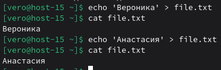

**>>** Добавляет текст в конец файла (не удаляет старое содержимое)

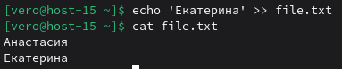

#### 2.Что такое перенаправление ввода? stderr,stdout;
```
Перенаправление ввода - это функциональность командной оболочки, с помощью которой можно изменить стандартные источники и приёмники данных для программ. Обычно программа принимает ввод с клавиатуры и отправляет результаты или ошибки на экран, но с помощью перенаправления эти потоки можно перенаправить, например, в файлы или в другие программы.
STDOUT (стандартный вывод) — это канал, через который программа передаёт основные результаты работы. По умолчанию эти данные выводятся на экран терминала. Например, список файлов, полученный командой ls, отправляется в stdout.
STDERR (стандартный поток ошибок) — это отдельный канал, предназначенный для вывода диагностических сообщений, предупреждений и ошибок. Даже если вывод программы перенаправлен в файл, сообщения об ошибках по умолчанию всё равно появляются на экране, если специально не перенаправить.
```
#### 3.Вывести содержание файла не используя текстовые редакторы;
```
команда cat
```

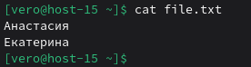


#### 4.Создать файл с содержимым не используя текстовые редактор;
```
echo "Привет" > file.txt
или
cat > file.txt << rrr
Первая строка
Вторая строка
Третья строка
rrr
```

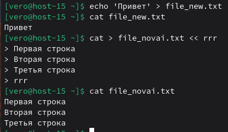

#### 5.пернеаправить stdout в stderr и обратно на примере команды kinit, ping, tracert
```
Перенаправление stdout → stderr:
1.Для команды kinit (Перенаправляю вывод kinit в stderr (ошибки останутся в stderr))
kinit vero@EXAMPLE.COM 1>&2
```

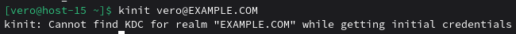

```
2.Для команды ping 
ping 2 8.8.8.8 1>&2
```

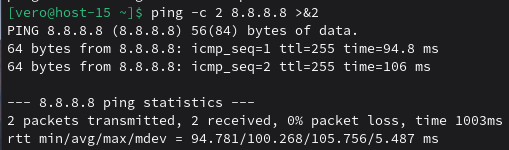

```
3.Для команды tracert (Использую альтернативную команду tracepath, которая уже установлена по умолчанию)
traceroute 8.8.8.8 1>&2
```

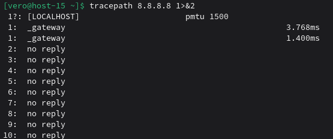

```
Перенаправление stderr → stdout
1.Для команды kinit (Неверные учетные данные)
kinit user@DOMAIN.LOCAL 2>&1
```

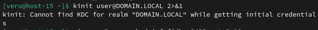

```
2.Для команды ping (Несуществующий хост)
ping ne-sush-fjenm-fkein-4756.net 2>&1
```

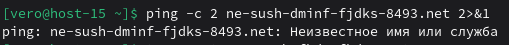

```
3.Для команды traceroute (Несуществующий хост)
traceroute ne-sush-fjenm-fkein-4756.net 2>&1
```

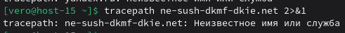


#### 6.чем отличаются stdout и stderr
```
STDOUT предназначен для вывода штатных результатов работы программы, в то время как STDERR используется для диагностических сообщений и ошибок. Эти потоки независимы друг от друга, что позволяет разделять нормальный вывод и сообщения об ошибках. При перенаправлении вывода в файл STDERR по умолчанию продолжает отображаться в терминале, если не указано иное.Нумерация потоков отличается: STDOUT имеет дескриптор 1, а STDERR - дескриптор 2. В скриптах часто используют разделение потоков для логирования - успешные операции пишут в один файл, ошибки в другой. STDERR обычно буферизуется построчно, что обеспечивает немедленный вывод сообщений об ошибках.В конвейерах STDERR по умолчанию не передается следующей команде, в отличие от STDOUT.
```
#### 7.что такое stdin?
```
STDIN (стандартный ввод) — это поток данных, который программа использует для получения входной информации. По умолчанию stdin связан с клавиатурой, то есть пользователь может вводить данные непосредственно в работающую программу. 
```
#### 8.как отправить весь вывод команды в пустоту?
```
Чтобы отправить весь вывод команды в пустоту (полностью игнорировать и stdout, и stderr), буду использовать команду:
command > /dev/null 2>&1
```

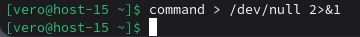