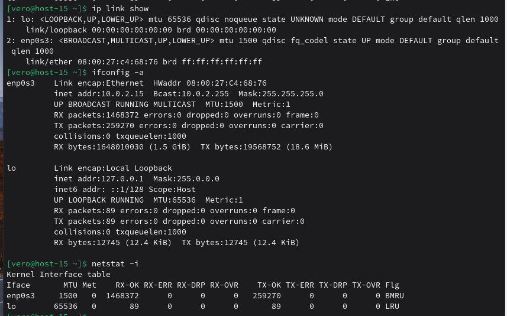
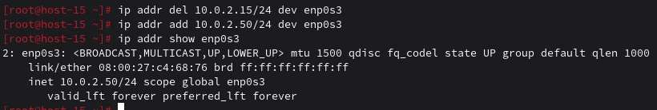
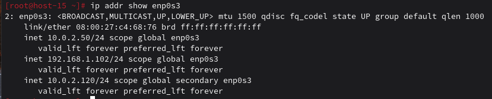
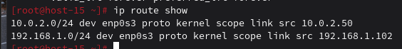

### сети
#### 1.Выведите список интерфейсов, какими способами можно это сделать?

`ip link show` - показывает все интерфейсы, их состояние и т.д.
`ifconfig -a` - показывает интерфейсы, IP-адреса и статус
`netstat -i` — показывает статистику сетевых интерфейсов (трафик, ошибки, сбросы).

#### 2.Попробуйте изменить ip адрес

Удаляем текущий IP, потом добавляем новый с помощью команды `ip addr add` и проверяем изменнения 

#### 3.Попробуте добавить несколько ip адресов на сетевую карту

Такой же командой добавляю еще пару ip адресов

#### 4.Выведите список маршрутов

Вывожу с помощью команды `ip route show`:

#### 5.Выведите arp таблицу

Вывожу командами `ip neigh show` или `arp -n` ARP-таблица пуста, потому что система не общалась с другими устройствами в сети.

#### 6.Что такое ip адрес?

IP-адрес (Internet Protocol address) — уникальный числовой идентификатор устройства в компьютерной сети, использующей протокол IP.

#### 7.Для чего нужны маршруты?

Маршруты (routes) определяют, куда отправлять сетевые пакеты. Они нужны для: определения куда отправлять пакеты вне локальной сети, определения через какой сетевой интерфейс отправить пакет, для локальная маршрутизация, для определённых сетей/подсетей

#### 8.Что за протокол arp?

ARP (Address Resolution Protocol) — протокол для определения MAC-адреса по IP-адресу в локальной сети.

#### 9.Что такое dhcp?

DHCP (Dynamic Host Configuration Protocol) — протокол для автоматической настройки сетевых параметров.

#### 10.Что такое dns?

DNS (Domain Name System) — система преобразования доменных имён в IP-адреса.

#### 11.Как называется один из протоколов синхронизации времени?

NTP (Network Time Protocol) — протокол синхронизации времени по сети.
Альтернативы: SNTP (Simple NTP) — упрощённая версия, PTP (Precision Time Protocol) — для высокой точности, chrony — современная реализация

#### 12.Что такое широковещательный запрос, зачем он нужен?

Широковещательный запрос (broadcast) — отправка пакета всем устройствам в сети одновременно. Для чего нужен: Обнаружение устройств (DHCP DISCOVER, ARP запрос), Объявление сервисов (Samba, NetBIOS), Мультикастинг — потоковое видео, VoIP, Сетевые протоколы — RIP, OSPF

#### 13.Какой адресс является широковещательным?

Последний адрес в подсети, на которой отправляются пакеты.

#### 14.Какие ещё параметры можно задать сетевой карте?

- Маска подсети - определяет, какие адреса находятся в локальной сети, а какие — вне её.
- Шлюз по умолчанию (gateway) - адрес маршрутизатора для выхода в другие сети.
- DNS-серверы - адреса серверов, которые переводят доменные имена в IP.
- MTU (Maximum Transmission Unit) - максимальный размер пакета данных, который ожет передаваться.
- MAC-адрес - уникальный физический адрес сетевой карты, который можно в некоторых случаях изменить (spoofing).
- Скорость и дуплекс соединения 
- ARP-настройки - время хранения записей, включение/выключение.
- Маршруты - можно задать статические маршруты для конкретных сетей.

#### 15.Что такое маска подсети? зачем она нужна?

Маска подсети (subnet mask) — определяет, какая часть IP-адреса относится к сети, а какая к хосту. Зачем нужна: Определение сети (какие устройства в одной подсети), Маршрутизация (различение локального и удалённого трафика), Разделение сети (создание подсетей), Безопасность (изоляция сегментов сети)