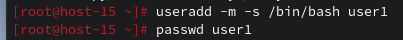
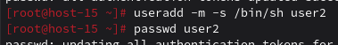
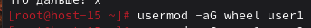
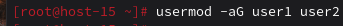
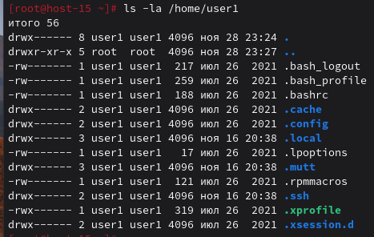
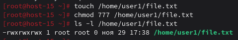
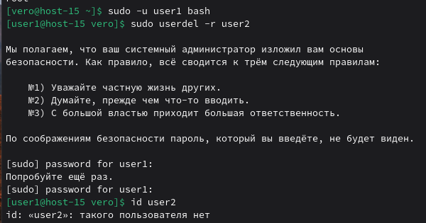
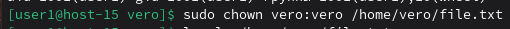
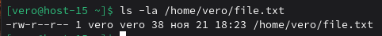

#### 1.Добавьте пользователей user1 и user2: 
```
1.1) user1 - оболочка bash 
1.2) user2 - оболочка sh 
1.3) установите им пароли
```
Добавляю пользователя с оболочкой bash и устанавливаю пароль:



Добавляю пользователя с оболочкой sh и устанавливаю пароль:



#### 2.Назначьте пользователю 1 группу администраторов, польователя 2 добавте в группу пользователя 1

Назначаю user1 группу администраторов 



Добавляю user2 в группу user1



#### 3.Что такое права доступа? Выведите права доступа на файлы в директории пользователя

Права доступа в Linux определяют, кто может читать, писать и выполнять файлы/директории для трех категорий:
```
Владелец (user)
Группа (group)
Остальные (others)
```
Вывела права доступа на файлы в директории пользователя



#### 4.Как изменить права на файлы? Создайте файл который будет на который у всез пользователей будут все возможные права
```
Права на файл можно изменить с помощью команды chmod
```
Я создала файл file.txt в домашней директории user1 и дала ему полные права доступа для всех пользователей системы.



#### 5.Как называется учётная запись встренного администратора в linux?

Учётная запись встренного администратора в linux - root

#### 6.Как выполнить команду от имени администратора?

Переключиться в root (sudo su -) и выполнить конкретную команду или выполнить команду от имени администратора (sudo /команда/)

#### 7.Есть ли ограничения у суперпользователя?

Суперпользователь имеет почти абсолютную власть в системе, но некоторые ограничения существуют: не может изменять неизменяемые файлы и может добавляться только к файлам, доступным только для добавления. Не удаётся выполнить запись в режим монтирования только для чтения или выполнить что-либо при монтировании без выполнения. Не может повторно смонтировать файловую систему в режиме чтения-записи, если её блочное устройство доступно только для чтения.Невозможно нарушить настройки SELinux.

#### 8.Удалите пользователя 2 с помощью пользователя 1.
Переключилась на user1 и удалила user2



#### 9.Как можно изменить владельца папки? измените владельца папки из пункта 4
```
Изменить владельца папки можно с помощью команды chown
```
Я изменила владельца папки file.txt на vero и проверила измения 



