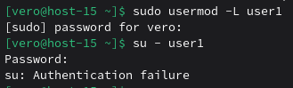

#### 1.Запретите пользователю user1 из предыдщуего задания выполнять вход в систему

#### 2.Как вы это сделали?

Я воспользовалась командой sudo usermod -L user1 , которая блокирует учетную запись пользователя user1. Она добавляет восклицательный знак ! перед хэшем пароля в файле /etc/shadow, что делает пароль недействительным. После этого пользователь не может войти в систему ни по паролю, ни через SSH, ни переключиться на свою учетную запись. При попытке входа система будет выдавать ошибку аутентификации.

#### 3.Какие ещё способы это сделать вы знаете?

Можно изменить оболочку пользователя на /usr/sbin/nologin через usermod -s, установить прошедшую дату истечения аккаунта usermod -e, или заблокировать пароль командой passwd -l. Также можно вручную отредактировать файлы /etc/passwd или /etc/shadow, добавив специальные флаги блокировки.

#### 4.Можно ли создать пользователей с одинаковыми username?

Нельзя создать пользователей с одинаковыми username, потому что каждый пользователь должен иметь уникальный идентификатор, а также username является ключом в файле паролей