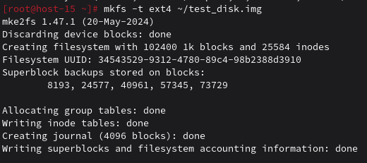
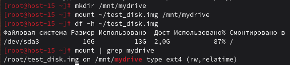
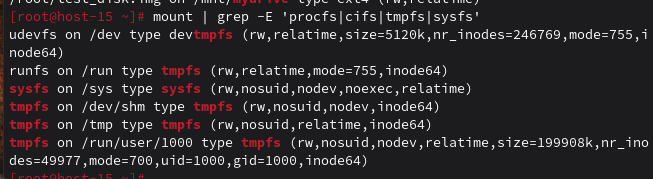
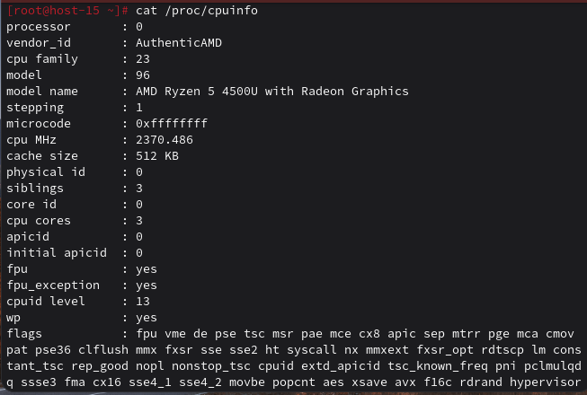
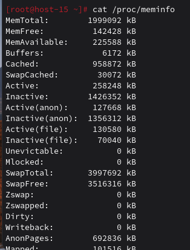

### ФС
#### 1.Какие файловые системы вы знаете?

Windows (NTFS, exFAT), Linux (ext4), macOS (APFS)

#### 2.Как можно классифиировать файловые системы? в чём отличия??

**По назначению:**
- Дисковые (ext4, NTFS) - для постоянного хранения данных на физических носителях
- Сетевые (NFS, CIFS) - для доступа к файлам через сеть между компьютерами  
- Виртуальные (procfs, sysfs) - предоставляют доступ к информации о системе и процессах в реальном времени

**По структуре:**
- Журналируемые (ext4, NTFS) - ведут журнал операций для повышения надежности при сбоях
- Нежурналируемые (FAT32) - не имеют журнала, что ускоряет работу но снижает отказоустойчивость

**По операционным системам:**
- Windows (NTFS) 
- Linux (ext4)
- macOS (APFS)

Отличия проявляются в надежности восстановления данных, скорости работы с разными типами файлов и поддерживаемом функционале.

#### 3.Какие файловые системы используются в linux?

**Ext4** — основная журналируемая ФС Linux с поддержкой томов до 1 эксабайта и отложенным выделением места.  
**XFS** — высокопроизводительная ФС для работы с большими файлами и интенсивных нагрузок с онлайн-дефрагментацией.  
**Btrfs** — современная ФС со встроенным RAID, снапшотами и контролем целостности данных через контрольные суммы.  
**ZFS** — продвинутая ФС с пулами хранения, самовосстановлением и мощной системой дедупликации данных.  
**FAT32** — универсальная ФС для совместимости между ОС с ограничением размера файла 4 ГБ без поддержки прав доступа.  
**exFAT** — оптимизированная ФС для флеш-накопителей без ограничений FAT32 с поддержкой больших файлов и разделов.  
**NTFS** — ФС Windows с полной поддержкой в Linux через NTFS-3g с журналированием и разграничением прав доступа.  
**F2FS** — ФС от Samsung для SSD-дисков с уменьшением износа ячеек через алгоритмы оптимизации записи.  
**JFS** — легковесная журналируемая ФС от IBM с низким потреблением ресурсов и высокой скоростью восстановления.  
**ReiserFS** — эффективная ФС для работы с тысячами мелких файлов с динамической индексацией и быстрым поиском.  
**procfs** — виртуальная ФС в /proc предоставляющая доступ к информации о процессах и параметрах ядра в реальном времени.  
**sysfs** — виртуальная ФС в /sys отображающая иерархию устройств и драйверов для взаимодействия с пространством ядра.  
**tmpfs** — ФС в оперативной памяти для временных файлов с автоматическим очищением при перезагрузке системы.  
**devtmpfs** — виртуальная ФС в /dev динамически создающая файлы устройств для подключенного оборудования.  
**cgroupfs** — виртуальная ФС в /sys/fs/cgroup предоставляющая интерфейс для управления ресурсами через контрольные группы.  
**debugfs** — отладочная ФС для разработчиков ядра позволяющая просматривать и изменять внутренние структуры данных.

#### 4.Как можно создать файловую систему на диске?

Для того чтобы создать файловую систему на диск нужно использовать команду mkfs (-t ext4 — тип файловой системы, ~/test_disk.img — диск, на котором создается файловая система)



#### 5.Как можно подключить диск в систему, что такое монтирование?
```
Монтирование — это подключение файловой системы к дереву каталогов. 
```
Я создала точку монтирования (mkdir /mnt/mydrive), смонтировали файловую систему, т.е. подключила файловую систему (test_disk.img) к папке (/mnt/mydrive) и проверила результат



#### 6.файловая система procfs, cifs, tpmfs,sysfs. В чём особенности каждой из них? Вывести каталоги к которым примонтированы эти файловые системыю

- procfs : виртуальная ФС для процессов и системной информации.
- cifs: для доступа к сетевым ресурсам Windows.
- tmpfs: хранится в ОЗУ, данные теряются после перезагрузки.
- sysfs: информация об устройствах и ядре.



#### 7.Как можно получить информацию о системе используя лишь команду cat? вывести ифонмацию о процессоре и состоянии памяти системы

Команда cat позволяет просматривать содержимое виртуальных файлов в директориях /proc и /sys, которые содержат подробную информацию о системе в реальном времени.
- `cat /proc/cpuinfo` - информация о процессоре(Показывает количество ядер, модель процессора, частоту, кэш и поддерживаемые инструкции.)
- `cat /proc/meminfo` - информация о памяти(Отображает общий объем ОЗУ, свободную память, кэш, буферы и своп.)
- `cat /proc/version` - информация о системе(Показывает версию ядра, компилятора и дату сборки.)
- `cat /proc/loadavg` - информация о нагрузке(Выводит среднюю нагрузку за 1, 5 и 15 минут.)
- `cat /proc/partitions` - информация о устройствах(Список всех разделов дисков с размерами.)

Процессор:



Память:

