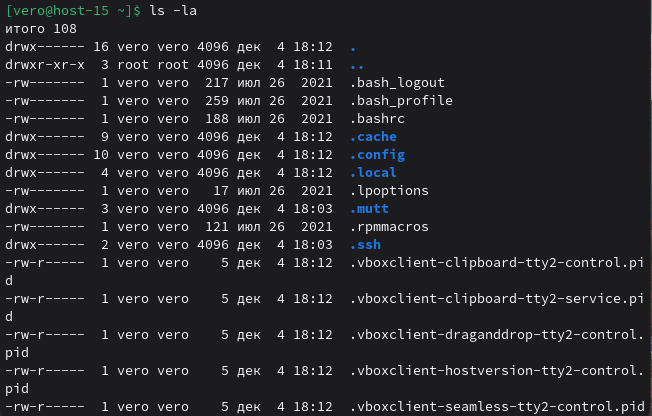
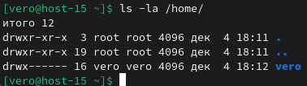
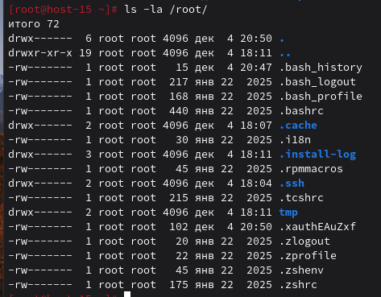
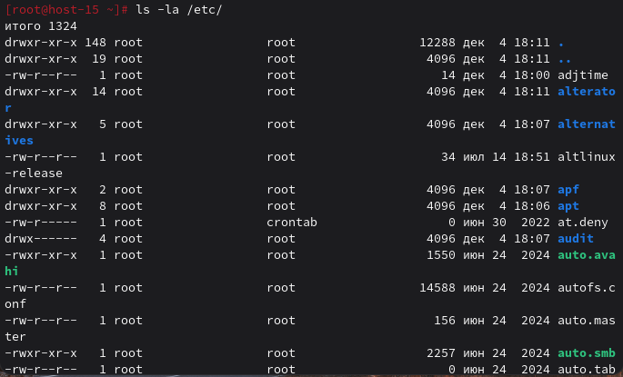

### СТРУКТУРА КАТАЛОГОВ
#### 1.Какая структура каталогов в linux? выведите список файлов в корне системы

Структура каталогов Linux организована по иерархическому стандарту FHS. Корневая директория / содержит основные каталоги: /bin (основные программы), /etc (конфиги), /home (папки пользователей), /root (папка администратора), /var (логи и изменяемые данные), /usr (пользовательские программы) и другие системные директории.

#### 2.Где хранятся папки пользователей в системе?

Папки пользователей хранятся в каталоге /home/.

#### 3.Где домашняя папка суперпользователя?

Домашняя папка суперпользователя находится в /root/.

#### 4.Где хранятся основые конфигурационные файлы в системе?

Основные конфигурационные файлы системы хранятся в каталоге /etc/.

#### 5.ЧТо за папки /bin,/sbin,usr/sbin,/usr/sbin

Папки /bin, /sbin, /usr/bin, /usr/sbin содержат исполняемые файлы (программы и утилиты):

- /bin - основные системные команды, доступные всем пользователям (например: ls, cp, cat, mv)
- /sbin - системные команды для администратора (например: fdisk, mkfs, ifconfig)
- /usr/bin - пользовательские программы и приложения (например: python, git, vim)
- /usr/sbin - дополнительные системные утилиты для администратора