### ПРОДОЛЖАЕМ
#### 1.Выведите содержимое fstab. Что хранится в fstab?

В fstab хранится таблица автоматического монтирования файловых систем при загрузке системы.

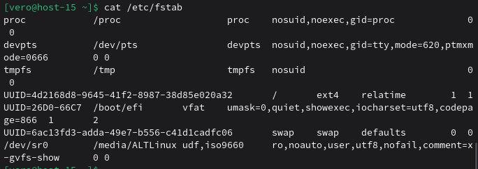

#### 2.Добавьте в виртуальную машину ещё один диск

В настройках добавила еще один диск.

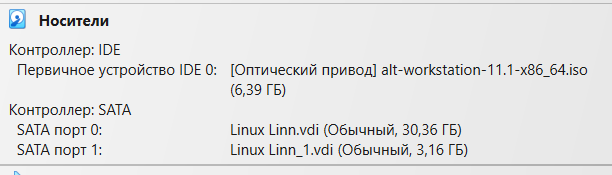

#### 3.Узнайте как ситема видит ваш диск - выведите информацию о блочных устройствах

Использую команду lsblk, чтоб вывести информацию о дисках 

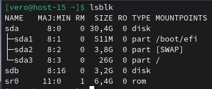

#### 4.С помощью полученной информации создайте на диске таблицу разделов и фаловую систему ext4

Создаю на диске таблицу разделов с помощью fdisk и настраиваю.

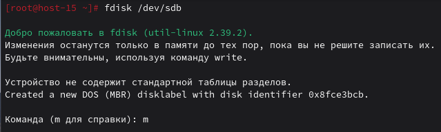

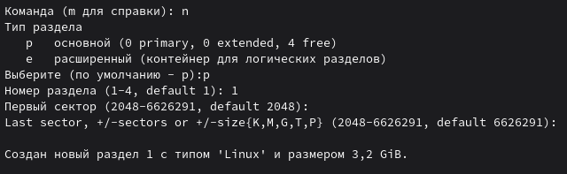

Cоздать файловую систему c использованием mkfs ext4 — тип файловой системы, /dev/sdb1— раздел на диске, где будет создана файловая система.

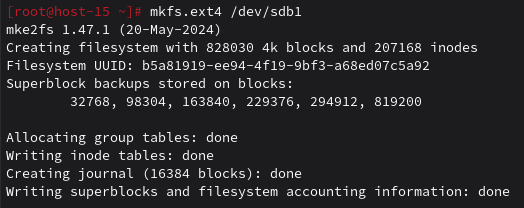

#### 5.Примонитруте диск в каталог /mnt

Монтирую с помощью mount и проверяю куда смонтирован диск.

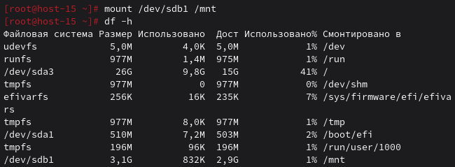

#### 6.Зайдите в каталог и создайте там файлы

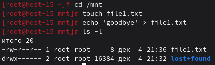

#### 7.Отмонтируйте диск и проверье остались ли файлы

Отмонтирую диск при помощи команды umount,  потом примонтирую его обратно при помощи команды mount, файл остался в целости.

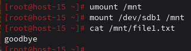

#### 8.Сделайте так чтобы диск автоматически подключался при загрузке систем ( добавьте информацию о нём с fstab)

При помощи команды blkid получаю UUID нового раздела

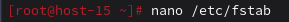

Добавляю в файл /etc/fstab информацию о диске

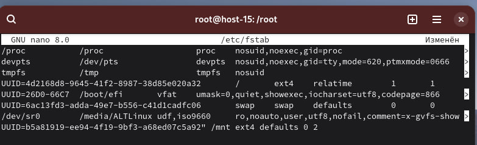

#### 9.Проверьте корретность записанных в fstab данных перед перезагрузкой

Проверяю корректность моего монтирования при помощи команды mount -a, командой findmnt вывожу информацию о ФС, смонтированной в mnt

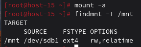

#### 10.Перезагрущите систему и убедитесь что диск был подключён к системе

После перезагрузки все на месте

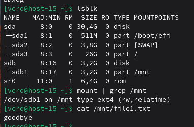