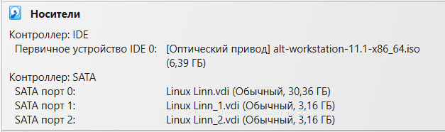
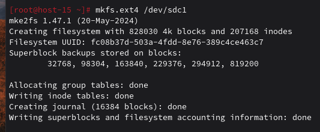
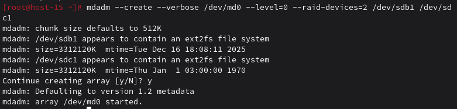
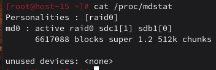
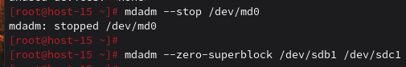
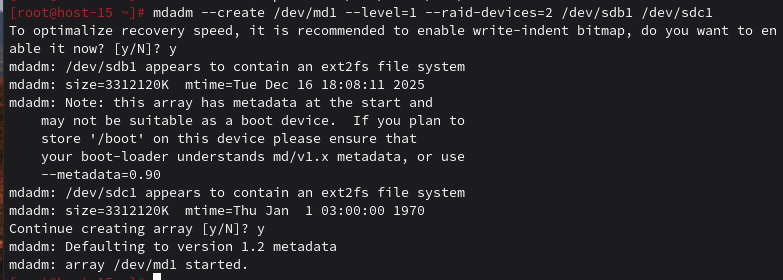

### Продолжаем
#### 1.Raid массивы, что такое и какие бывают

RAID — технология объединения нескольких физических дисков в логический массив для: повышения производительности, увеличения надёжности, комбинации этих целей

- RAID 0 — Чередование (максимальная скорость, нет надёжности, ёмкость = сумма всех дисков)  
- RAID 1 — Зеркало (полная отказоустойчивость, скорость записи как у одного диска, ёмкость = одного диска)  
- RAID 5 — Чередование с чётностью (минимум 3 диска, отказоустойчивость, ёмкость = (N-1)×размер диска)  
- RAID 10 — Зеркало + чередование (минимум 4 диска, высокая скорость и надёжность, ёмкость = половина суммы дисков)

#### 2.Добавьте в виртуальную машину 2 диска отформатируйте их в ext4

С прошлого задания остался диск с форматированием в ext4, создаю еще один 

Форматирую его в ext4

#### 3.Создайте из них raid 0 массив

#### 4.Проверье всё ли работает

#### 5.Удалите raid0 и создайте raid1

Останавливаю RAID 0 и удаляю суперблоки с дисков

Создаю RAID 1

#### 6.В чём между ними разница?

RAID 0 (чередование) не обеспечивает отказоустойчивости — при отказе одного диска все данные теряются. Он даёт максимальную производительность чтения и записи за счёт параллельной работы дисков, эффективность использования ёмкости составляет 100% (например, из двух дисков по 10GB получается 20GB доступного пространства). Минимальное количество дисков — 2. Обычно используется для временных данных, кешей или задач, где важна скорость, а не надёжность.

RAID 1 (зеркало) обеспечивает отказоустойчивость — массив продолжит работу при отказе одного диска. Скорость чтения высокая (можно читать с обоих дисков), но запись идёт медленнее, так как данные дублируются. Эффективность ёмкости — 50% (из двух дисков по 10GB доступно только 10GB). Минимальное количество дисков — 2. Применяется для критически важных данных, системных дисков и задач, где надёжность важнее скорости и объёма.

#### 7.Есть ли файловые системы которые поддерживают raid массивы без стороненго ПО

Да. Это так называемые "самоорганизующиеся" файловые системы: 

- ZFS (OpenZFS) — имеет встроенную поддержку RAID-Z (аналог RAID 5), RAID-Z2 (аналог RAID 6) и RAID-Z3 (выдерживает отказ 3 дисков); плюсы: контроль целостности данных, снэпшоты, компрессия. 
- Btrfs — поддерживает RAID 0, 1, 10, 5, 6 на уровне файловой системы; плюсы: дедупликация, снэпшоты, online-изменение уровня RAID.

#### 8.Можно ли создать raid массив во время установки системы?

В установщиках большинства дистрибутивов, включая ALT Linux, Ubuntu, Debian, RHEL и CentOS, можно создать программный RAID-массив на этапе разметки дисков — в меню ручной настройки достаточно выбрать пункт «Configure software RAID» (или аналогичный), затем указать уровень RAID (0, 1 и др.) и добавить в массив нужные диски.