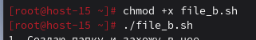
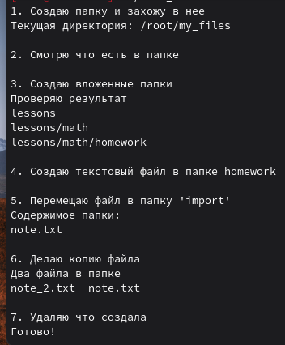

### Скриптуем по полной
#### 1.Что такое шебанг?

Шебанг — это специальная последовательность символов в первой строке скрипта, которая указывает системе, каким интерпретатором следует выполнять этот скрипт.

#### 2.Обязательно ли исполняемый файл дожен иметь соотвествующее расширение?

Нет, не обязательно. В Linux расширение файла не определяет его исполняемость или тип.

#### 3.Напишите скрипт который выполнит автоматически действия из блока работы с файлами. ( не забудьте включить set -euo pipefail для того что бы ваш скрипт было удобнее отлаживать. Опишите что включают эти флаги)

Что делают флаги set -euo pipefail: 
- `set -e` — прерывать выполнение скрипта при первой ошибке (если команда завершается с ненулевым кодом)  
- `set -u` — считать ошибкой обращение к неустановленным переменным и немедленно прерывать выполнение  
- `set -o pipefail` — возвращать код ошибки всего конвейера, если хотя бы одна команда в цепочке завершилась с ошибкой  
- `set -euo pipefail` — комбинированная запись всех трёх флагов для максимальной строгости и отказоустойчивости скрипта

Создала скрипт, который выполнит автоматически действия из блока работы с файлами:

```
#!/usr/bin/bash
set -euo pipefail

echo "1. Создаю папку 'my_files' и захожу в неё"
mkdir -p my_files
cd my_files
echo "Текущая директория: $(pwd)"
echo

echo "2. Смотрю что есть в этой папке"
ls
echo

echo "3. Создаю вложенные папки: lessons/math/homework"
mkdir -p lessons/math/homework
echo "Проверяю результат:"
find lessons
echo

echo "4. Создаю текстовый файл в папке homework"
echo "2+2" > lessons/math/homework/note.txt
echo

echo "5. Перемещаю файл в папку 'important'"
mkdir -p important
mv lessons/math/homework/note.txt important/
echo "Содержимое папки:"
ls important
echo

echo "6. Делаю копию файла"
cp important/note.txt important/note_2.txt
echo "Два файла в папке 'important':"
ls important
echo

echo "7. Выхожу из папки и удаляю всё что создал"
cd ..
rm -rf my_files
echo "Готово!"
echo
```
Cохраним его в файл file_b.sh, в консоли делаем этот файл исполняемым при помощи команды `chmod +x task_script.sh`



Запускаем его и в консоль выводится:

