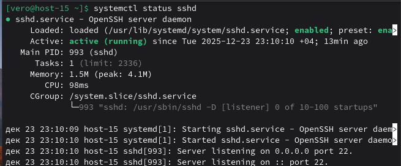
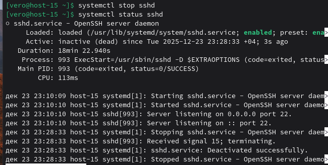
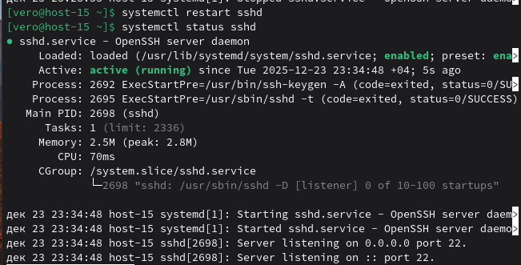
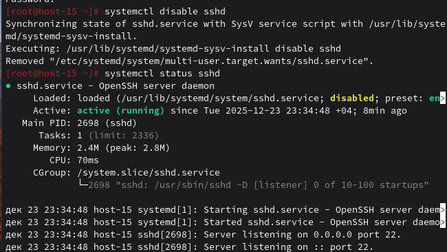
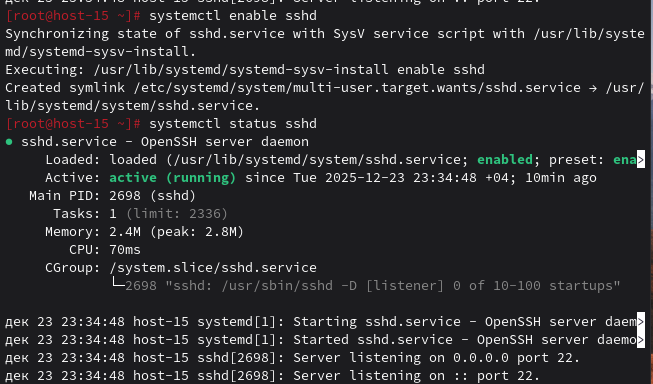

### Юниты
#### 1.Что такое systemd юнит?

Systemd юнит — это конфигурационный файл, который описывает, как systemd должен управлять службой, сокетом, устройством, точкой монтирования или другим системным ресурсом.

#### 2.Проверье статус любого systemd юнита, какую информацию выводит эта кманда?

Команда `systemctl status` - проверяет статус, в моем случае сервиса sshd. Название юнита и его описание.Состояние: active (running), inactive (dead), failed. Загружен ли юнит в память.Путь к файлу юнита. PID главного процесса. Последние записи в журнале (логи). Ссылки на связанные юниты.Время запуска и работы

#### 3.ПОпробуйте оставновить сервис.

Командой `systemctl stop` - останавливаею сервис

#### 4.Перезапустите его.

Командой `systemctl restart` - перезапускаю сервис

#### 5.УДалите из автозагрузки

Командой `systemctl disable` - Удаляю из автозагрузки

#### 6.Верните обратно

Командой `systemctl enable` - возращаю обратно

#### 7.Что такое таймеры?

Systemd таймеры (.timer) — это юниты, которые позволяют планировать запуск других юнитов (как правило, сервисов или скриптов) по времени.
Для планирования задач в systemd используйте:
- OnCalendar= — когда задача должна выполняться в фиксированное время (например, ежедневная рассылка отчётов).
- OnBootSec= или OnUnitActiveSec= — когда задача должна выполняться с определённым интервалом во время работы системы (например, проверка обновлений каждые 6 часов после загрузки или еженедельная очистка кэша через 7 дней после предыдущей очистки). Эти таймеры «пропускают» срабатывания, если компьютер выключен.

