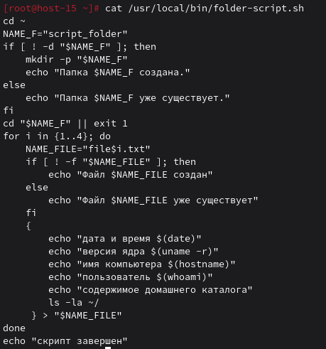
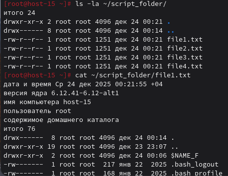
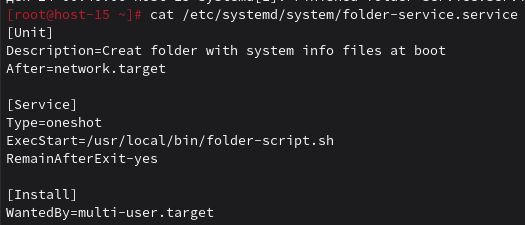
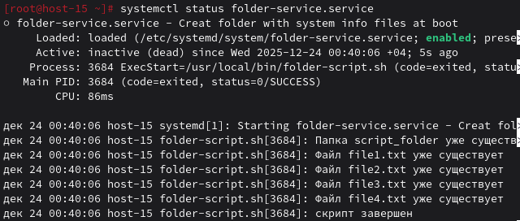
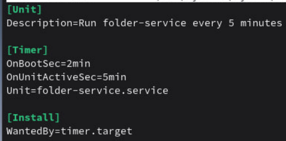
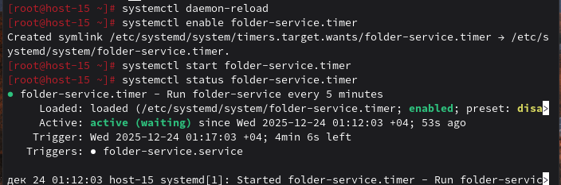
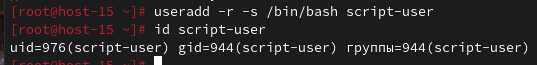
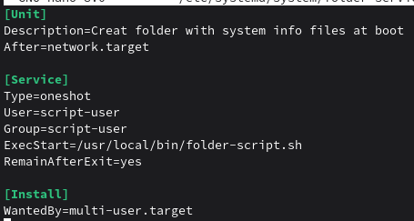
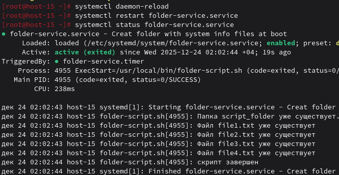

### Пишем юниты
#### 1.Создайте скрипт который создаёт папку заполняет её файлами ( имена 1-4 ) и записывает в них информацию о текущей дате, версии ядра, имени компьютера и списе всех файлов в домашнем каталоге пользователя от которого выполняется скрипт( не забудьте сдлеать проверку на существование файлов и папок)

Cоздаю скрипт в `/usr/local/bin/`:

Даю права на выполнение: `chmod +x /usr/local/bin/folder-script.sh`

Проверяю:

#### 2.Создайте юнит который будет вызывать этот скрипт при запуске. Проверьте

Создаём сервисный юнит: `nano /etc/systemd/system/folder-service.service`

- `systemctl daemon-reload` (Перезагружаем конфигурацию systemd)
- `systemctl enable folder-service.service` (Включаем автозагрузку)
- `systemctl start folder-service.service` (Запускаем вручную для проверки)
- `systemctl status folder-service.service` (Смотрим статус)

#### 3.Создайте таймер который будет вызывать выполнение одноимённого systemd юнита каждые 5 минут.

Создаем таймер: `sudo nano /etc/systemd/system/folder-service.timer`

Включаем, запускаем и проверяем статус таймера

#### 4.От какого пользователя вызыаются юниты поумолчанию?

По умолчанию systemd юниты выполняются от пользователя root

#### 5.Создайте пользователя от имени которого будет выполняться ваш скрипт.

Создаем системного пользователя и проверяем 

#### 6.Дополните юнит информацией о пользователе от которого должен выплняться скрипт.

Обновляем:

И проверяем от какого пользователя запустился

#### 7.Дополните ваш скрипт так, что бы он независимо от местоположения всега выполнялся в домашней папке того кто его вызывает.

Из первого пункта видно, что мой скрипт уже использует cd ~, что переходит в домашнюю директорию текущего пользователя. Это автоматически решает проблему.