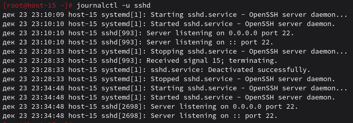
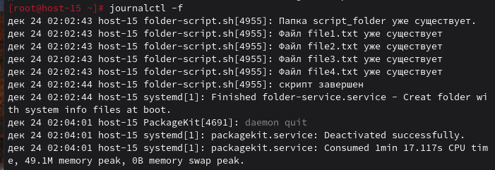
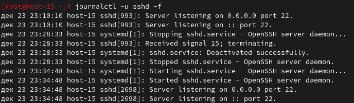

### Журнальчики
#### 1.Посмотретите журналы ssh

Вывожу журналы ssh с помощью команды `journalctl -u sshd`

#### 2.Выведите журналы в реальном времени

Вывожу журналы ssh в реальном времени с помощью команды `journalctl -а`

#### 3.Выведите лог в реальном времени для службы sshd

Вывожу лог в реальном времени для службы sshd командой `journalctl -u sshd -f`

#### 4.Можно ли без комады journalctl прочитать логи systemd?

Нет, нельзя напрямую читать логи systemd, так как они хранятся в бинарном формате

#### 5.Сколько будет 2-2?

0