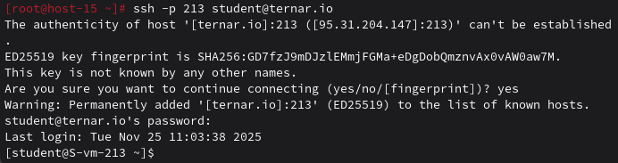
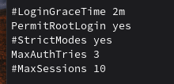
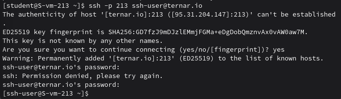
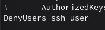

### Настриваем
#### 1.Какой по умолчанию используется порт для поключения?

По умолчанию SSH использует порт 22.

#### 2.Можно ли его изменить? если да то как?

Да, для этого нужно отредактировать файл конфигурации SSH-сервера, а именно раскомментировать директиву Port и изменить значение 22 на нужное.

#### 3.Какая служба отвечает за обработку запросов на подключения по ssh?

Служба sshd

#### 4.Какой файл конфигурации отвечает за его настройку?

Файл, находящийся по пути: /etc/ssh/sshd_config

#### 5.Попробуйте подключиться по ssh к предоставленному вам серверу

Подключаюсь с помощью команды ssh -p 213 student@ternar.io(так как порядковый номер в исполоне 13)

#### 6.Отредактируйте файл настроек на сервере так, чтобы была возможность подключиться к серверу используя пользователя root

Через vi открываю файл конфигурации и меняю строчку PermitRootLogin на Yes

#### 7.Измените колличество ошибок ввода пароля перед сборосом соединения, покажите эти измененения

Через vi открываю файл конфигурации и меняю строчку MaxAuthTries на 3 количество попыток(см. фото выше).

и перезапускаю SSH `sudo systemctl restart sshd`

#### 8.Создайте пользователя ssh-user и попробуйте им подключиться к серверу

Создаю пользователя с помощью команды `useradd -m`, придумываю сложный пароль и подключаюсь к серверу

#### 9.Ограничте ему возможность подключения к серверу

Доступ ограничен через "черный список" в настройках службы sshd

#### 10.Как вы это сделали?

В конце файла добавила строку DenyUsers ssh-user

#### 11.Что хранится в файле known_hosts?

Файл хранит отпечатки ключей SSH-серверов, к которым я подключались.