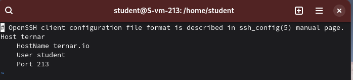
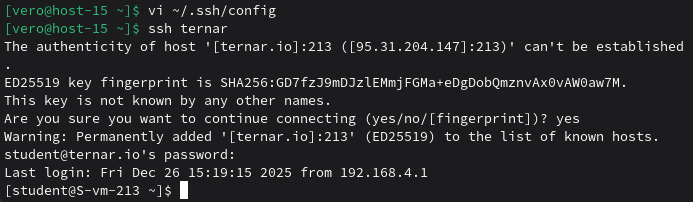

### Конфижим для удобства
#### 1.Где хранятся пользвательские и системные настройки подключения?

Пользовательские настройки хранятся в домашнем каталоге по адресу ~/.ssh/config, а системные настройки для всех пользователей - в файле /etc/ssh/ssh_config

#### 2.Что за файл options?

Это конфигурационный файл SSH-клиента, где можно задавать параметры подключения для разных хостов.

#### 3.Отредактируйте файл options так, чтобы можно было подключаться не вводя имя пользвателя и порт

Открываю `vi ~/.ssh/config` и вписываю данные моего сервера

#### 4.Назовите подключение удобным для вас спсобом

Назвала ternar

#### 5.Проверьте работоспособность

