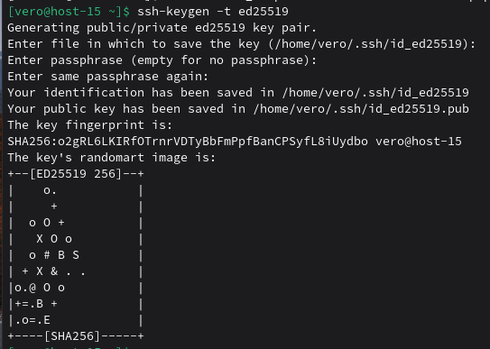
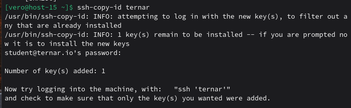
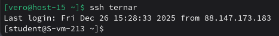
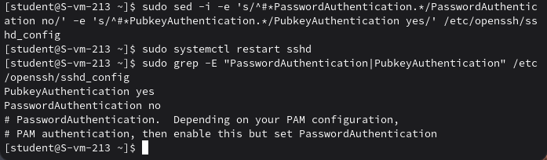

### Ключики
#### 1.Что такое ssh ключи и зачем они нужны?

SSH-ключи — это пара криптографических ключей (публичный и приватный) для аутентификации вместо паролей.
Они нужны для того, чтобы: не вводить пароль каждый раз, безопаснее паролей, можно дать доступ без передачи пароля, можно отслеживать, кто подключился

#### 2.Как их создать?

При помощи команды: ssh-keygen -t ed25519, она генерирует и приватный, и публичный ключ

#### 3.Создайт пару публичный/приватный ключ ed_25519, где они хранятся?

Создаю пару ключей:

По умолчанию ключи сохраняются в скрытой папке .ssh домашней директории пользователя: ~/.ssh/id_ed25519 (приватный), ~/.ssh/id_ed25519.pub (публичный).

#### 4.Скопируйте публичный ключ на ваш сервер, в каком файле он будет храниться?

Перекидываю публичный ключ на сервер с помощью команды ssh-copy-id. При использовании этой команды ключ будет сохранен на сервер в файл /home/user/.ssh/authorized_keys.

#### 5.Попробуйте подключиться к серверу, у вас запросили пароль?

Ура, пароль больше не нужно вводить 

#### 6.Запретите подключение с паролем для всех пользователей, оставьте только с помощью ключа.

Я делаю это с помощью команды `sudo sed -i -e 's/^#*PasswordAuthentication.*/PasswordAuthentication no/' -e 's/^#*PubkeyAuthentication.*/PubkeyAuthentication yes/' /etc/ssh/sshd_config` и проверяю

