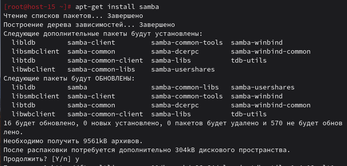
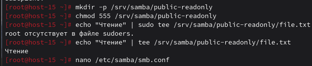
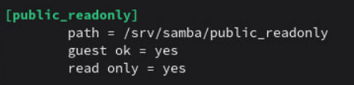
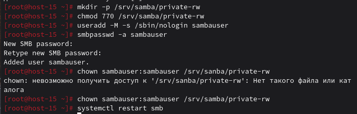
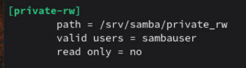
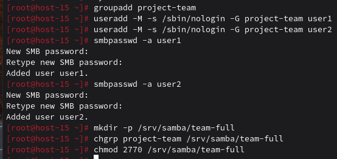
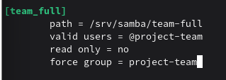
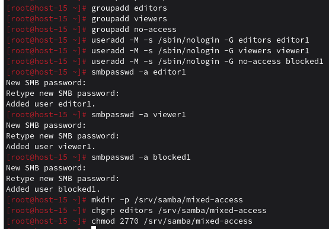
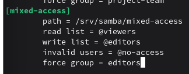

### Шарим
#### 1.Установите пакет samba

Устанавливаю пакет samba

#### 2.ЧТо такое побщая папка, зачем оно может быть нужно?

Общая папка (share) — это директория в сети, доступная нескольким пользователям или компьютерам.
Зачем нужно: обмен файлами между разными ОС, централизованное хранилище (один источник файлов для всех), несколько пользователей работают с одними файлами, доступ к фильмам/музыке с разных устройств

#### 3.Создайте общую папку без пароля с правами только на чтение файлов

Создаю папку, устанавливаю права только на чтение для всех(555), текстовый файл

Для настройки работы самой `Samba`, надо открыть `smb.conf` и прописать имя, путь

#### 4.Создайте общую папку с паролем с правами на чтение и запись

Создаю папку, устанавливаю на нее права на чтение и запись только у владельца и группы (770), создаю пользователя samba и настраиваю права

Прописываем в `smb.conf`:

#### 5.Создайте общую папку с доступом для какой-то группы с полными правами

Создаём группу, пользователей без домашней директории, добавляем их в группу, добавляем в Samba, создаём папку для общего доступа, назначаем группу project-team владельцем папки и устанавливаем права: полный доступ для группы

Прописываем в `smb.conf`:

#### 6.Создайте общую папку в которой у одной группы будет полный доступ, а у другой только доступ на чтение. Третья группа не должна иметь к ней доступа

Создаём группы editors, viewers, no-access, создаём пользователей editor1, viewer1, blocked1 и добавляем их в соответствующие группы, добавляем пользователей в Samba, создаём папку mixed-access, назначаем группу editors владельцем и устанавливаем права 2770.

Прописываем в `smb.conf`:

