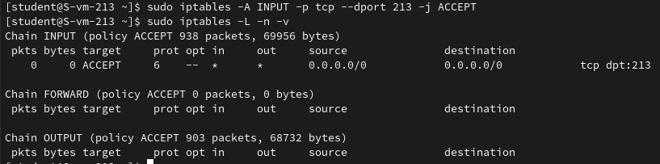
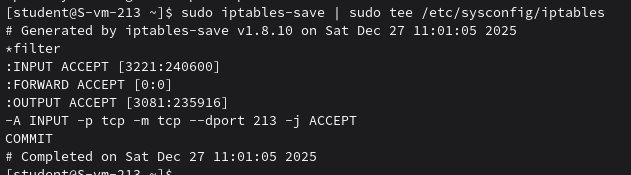

### Открываем iptables
#### 1.Установите iptables

Устанавливаю iptables:
```
sudo apt-get update
sudo apt-get install iptables
```
#### 2.Проверьте осталась ли возможность подключения по ssh к вашему серверу

Да, возможность осталась

#### 3.Почему может пропасть такая возможность?

Такое происходит если в цепочке `INPUT` нет разрешающего правила для порта `SSH` или если политика по умолчанию запрещает все входящие пакеты.

#### 4.Откройте нужный порт на сервере чтобы восстановить подключение

Отрываю порт командой: `sudo iptables -A INPUT -p tcp --dport 213 -j ACCEPT` и проверяю правила 



#### 5.Это будет udp или tcp прот?

Это будет `tcp` порт, так как `SSH `работает через него.

### Сохраняем
#### 7.Сохраняются ли записанные вами правила после перезагрузки?

Нет, правила iptables не сохраняются автоматически после перезагрузки. Без специальных действий все правила, добавленные через iptables команды, будут потеряны при перезагрузке системы.

#### 8.Как их сохранить?

Сохраняю командой `sudo iptables-save | sudo tee /etc/sysconfig/iptables`

