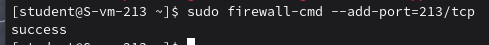
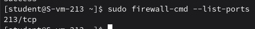
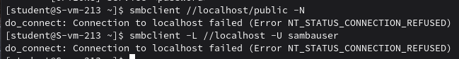
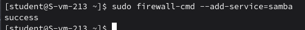
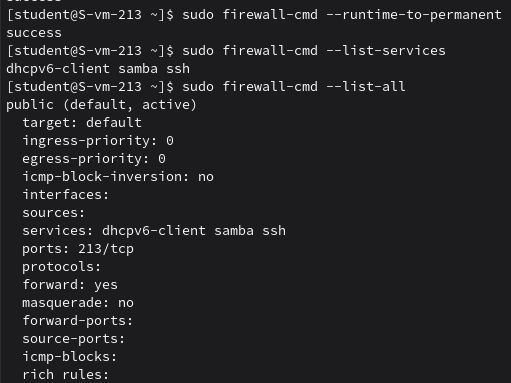

### Открываем firewald
#### 1.Удалите iptables и установите firewalld

Удаляю iptables, устанавливаю firewalld:
```
sudo apt-get remove iptables 
sudo apt-get install firewalld
```

#### 2.Попробуйте так-же проверить возможность подключения по ssh

Не подключилось по ssh 

#### 3.Если её нет то откройте порт

Открываю порт командой `sudo firewall-cmd --add-port=213/tcp`



#### 4.Выведите список открытых портов с помощью firewall-cmd

Вывожу командой `sudo firewall-cmd --list-ports`:



#### 5.Можно ли там добавить порты по названию сервиса?

Да, можно Firewalld использует предопределённые сервисы. Например командой `sudo firewall-cmd --add-service=...`. Вместо многоточая подставить нужный нам сервер

#### 6.На вашей Локальной виртуальной машине попробуйте подключиться к серверу samba из предыдущих заданий

Не получается открыть 



#### 7.Если не получилось то откройте нужные порты

Открываю порт сервиса Samba командой `sudo firewall-cmd --add-service=samba`



#### 8.Сделайте так чтобы изменения были постоянными

Сохраняю все изменения на постоянную одной командой: `firewall-cmd --runtime-to-permanent`. Чтоб при создании правила сразу сделать его постоянным, надо добавить ключевое слово - `permanent`. Проверяю командой `sudo firewall-cmd --list-all`

