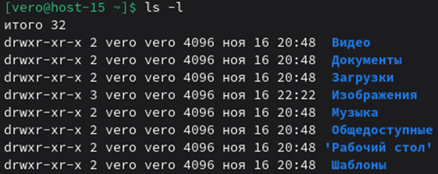
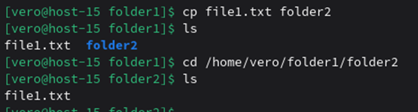
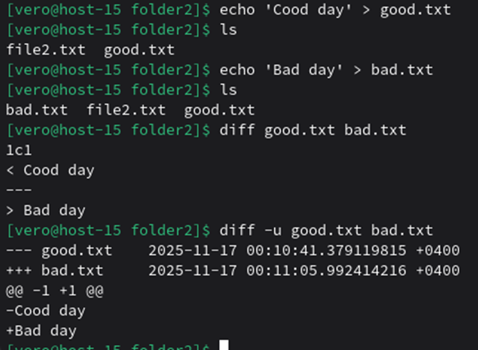
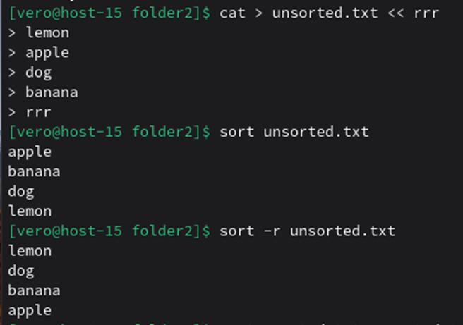
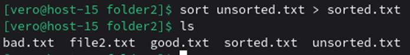
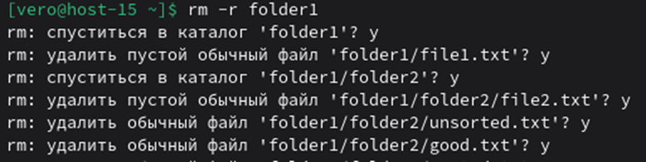

# Работа в консольке
Work whith files
1) Переместиться между директориями
cd <directory>

cd – (Перейти в предыдущую директорию)

2) Вывести список файлов в директории
ls

3) Вывести список Всех файлов в директории
ls -l # Детальная информация

ls -a  # Показ скрытых файлов

4) Создать папку с подпапками
mkdir -p parent/child

5) Внутри папки создать файлик и записать в него что-нибудь
# перейти в папку
echo "Привет, мир!" > hello.txt # создать файл и записать в него текст

6) Переместить файл из одно директории в другую
mv file1.txt folder2

7) скопировать файл из одной директории в другую
cp file1.txt folder2

8) переименовать файл
mv file1.txt new_name.txt

9) сравнить содержимое файла
# Создадим два файла для сравнения
echo "текст 1" > file1.txt
echo "текст 2" > file2.txt
# Простое сравнение
diff file1.txt file2.txt
# Сравнение с контекстом
diff -u file1.txt file2.txt

10) отсортировать содержимоей файла по возрастанию и убыванию
# Создадим файл с неотсортированными данными
cat > unsorted.txt << rrr
lemon
apple
dog
banana
rrr
# Сортировка по возрастанию (алфавиту)
sort unsorted.txt
#Сортировка по убыванию
sort -r unsorted.txt
# Сохранить отсортированный результат в файл
sort unsorted.txt > sorted.txt

11) удалить все папки и файлы
# Удалить папку с содержимым(безопасно)
rm -r folder_with_files
# Удалить все файлы в текущей директории (небезопасно)
rm -rf *

